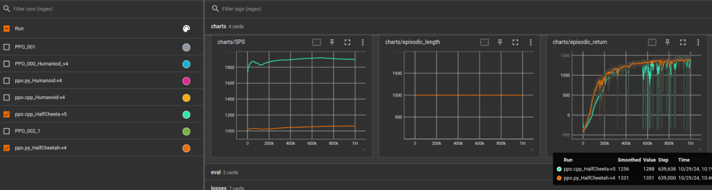
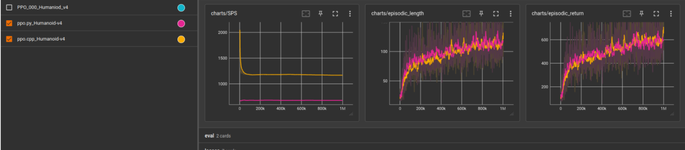

# ppo.cpp
This repository implements PPO for continuous action spaces in C++ matching the [CleanRL](https://github.com/vwxyzjn/cleanrl) python implementation closely. It also contains a [minimum port](libs/gymcpp) of [gymnasium](https://github.com/Farama-Foundation/Gymnasium) to C++, containing the needed functionality for PPO.
Additionally, the repository provides environments for mujoco, [half_cheetah_v5](libs/gymcpp/mujoco/half_cheetah_v5.h), [humanoid_v4](libs/gymcpp/mujoco/humanoid_v4.h), [hopper_v5](libs/gymcpp/mujoco/hopper_v5.h) and [ant_v5](libs/gymcpp/mujoco/ant_v5.h), as well as an environment for autonomous driving with the CARLA leaderboard 2.0.

The repository also implements Asynchronous Collection Proximal Policy Optimization (AC-PPO) which parallelizes data collection via multithreading and cuda streams, leading to faster training time than PPO in nonhomogeneous environments.
The idea is described in Appendix B.1 of this [paper](https://arxiv.org/abs/2504.17838).

To run the training and evaluation of with the CARLA leaderboard 2.0, you also need to download and set up the [CaRL repo](https://github.com/autonomousvision/CaRL).

We welcome pull request for more gymnasium environments or other translated CleanRL algorithms.

## Setup
To most convenient way to compile and run the program is to build the singularity container and run the code inside that.
Building the container can take a while, depending on your CPU power, because it builds several libraries and needs 12 GB of space. I have tested the code with singularity-ce version 3.11, but other version should work as well.
Singularity binaries are available [on GitHub](https://github.com/sylabs/singularity/releases) for most Linux distributions.
```Shell
cd tools
sudo singularity build ppo_cpp.sif make_singularity_image.def
```
Alternatively you can setup your own computer by installing all necessary libaries. You can have a look at [make_singularity_image.def](tools/make_singularity_image.def) on how to do it.
This often takes some time and you will face various issues, so it is only recommended for experienced C++ users.

## Compiling
The code can be compiled via cmake:
```Shell
cd /path/to/ppo.cpp
singularity exec tools/ppo_cpp.sif cmake -B build -DCMAKE_BUILD_TYPE=Release -G "Ninja"
singularity exec tools/ppo_cpp.sif cmake --build build -j$(nproc)
```

## Training models

### CARLA
To train CARLA models have a look at the training scripts in [CaRL](https://github.com/autonomousvision/CaRL/blob/main/CARLA/team_code/train_carl_cpp.sh).  
Generally you need to build the container, compile the program and then set the paths correctly:
```Shell
--ppo_cpp_install_path /path/to/folder_with_binaries
--cpp_singularity_file_path /path/to/ppo_cpp.sif
```

### Mujoco

To run the mujoco model cd into the repositories directory and run either of these two commands.
The environment can be set via the `--env_id` variable. Humanoid-v4, HalfCheetah-v5, Hopper-v5 and Anv-v5 are currently supported.
You can find documentation for the mujoco environments in the [gymnasium docs](https://gymnasium.farama.org/environments/mujoco/), the implementations are identical.
Other hyperparameters can be similarly set via the program arguments.
```Shell
cd /path/to/ppo.cpp
singularity exec --nv tools/ppo_cpp.sif build/ppo_continuous_action --env_id Humanoid-v4
singularity exec --nv tools/ppo_cpp.sif build/ac_ppo_continuous_action --env_id HalfCheetah-v5
```

### Multi-GPU training
Libtorch does not natively support multi-gpu training. 
We implemented the multi-gpu communication ourselves using the backend code of [torch-fort](https://github.com/NVIDIA/TorchFort).
To use multiple GPUs for training the code needs to be started with mpirun (`-n` = number of GPUs), similar how pytorch DDP ist started with torchrun:
```Shell
singularity exec --nv tools/ppo_cpp.sif mpirun -n 1 --bind-to none  build/ac_ppo_continuous_action --env_id HalfCheetah-v5
```

## Reproducibility
We implemented the Mujoco environments mainly to check if the implementation is correct.
Below we compare the runs of [ppo_continuous_action.cpp](src/ppo_continuous_action.cpp) with cleanRL's [ppo_continuous_action.py](https://github.com/vwxyzjn/cleanrl/blob/master/cleanrl/ppo_continuous_action.py).
There are some numerical differences but the runs are very close for RL standards.





Interestingly the C++ implementation is up to 72% faster in SPS than the python implementation on the same hardware without any specific optimizations.
All runs are in CPU mode which is faster than GPU mode for these tiny Mujoco networks in both languages, the GPU default in ppo_continuous_action.py is suboptimal.
For the larger CNN used in the CaRL model the speedup of the GPU in enough to outweigh the GPU-CPU communication overhead.

## Known problems

The code implements the DD-PPO preemption trick.
I had some runs with poor performance using the preemption trick which is why I disabled it.
It could be that the trick itself caused the performance degradation but there might also be a bug, so I do not recommend using it right now (use_dd_ppo_preempt=0).

We are using cuda streams to parallelize neural network forward passes on the GPU. 
Cuda is currently not able to run deterministic algorithms in combination with cuda streams.
There are 3 solutions to this:
* `--torch_deterministic 0` Turns off deterministic algorithms. Often reproducible training runs are not necessary.
* set the environment variable `CUBLAS_WORKSPACE_CONFIG=:4096:8`. This enables deterministic algorithms but induces a large GPU memory overhead (~15 GB for the CaRL model)
* set the environment variable `CUBLAS_WORKSPACE_CONFIG=:16:8`. This enables deterministic algorithms but reduces performance.

## News
[19/Oct/2025] Added Ant-v5 and Hopper-v5 environments to mujoco. Singularty container now fully supports mujoco environments. Mujoco renderer can now render multiple environments in parallel.
[10/Aug/2025] Initial code release.

## License

The original code in this repository is provided under the Civil-M license, which is a variant of the MIT license that bans dual-use. [The license](LICENSE) contains a partial copyleft which requires derivative work to include the civil clause in their license. For further information see the accompaning documentation on [Civil Software Licenses](docs/Jaeger2025LicenseWhitepaper.pdf).

## Citation
If you find the repo useful, please consider giving it a star &#127775;.
To cite the paper please use the following bibtex:
```BibTeX
@article{Jaeger2025ArXiv, 
        author = {Bernhard Jaeger and Daniel Dauner and Jens Beißwenger and Simon Gerstenecker and Kashyap Chitta and Andreas Geiger}, 
        title = {CaRL: Learning Scalable Planning Policies with Simple Rewards}, 
        year = {2025}, 
        journal = {arXiv.org}, 
        volume = {2504.17838}, 
}
```

## Acknowledgements
The original code in this repository was written by Bernhard Jaeger.

Code like this is build on the shoulders of many other open source repositories.
Particularly, we would like to thank the following repositories for their contributions:

* [clean_rl](https://github.com/vwxyzjn/cleanrl/tree/master)
* [torchfort](https://github.com/NVIDIA/TorchFort)
* [envpool](https://github.com/sail-sg/envpool)

We also thank the creators of the numerous libraries we use. Complex projects like this would not be feasible without your contribution.
