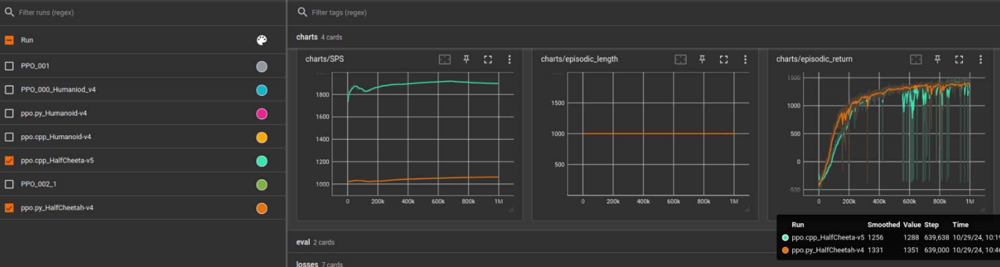
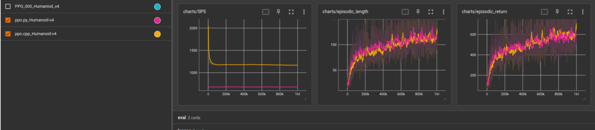

This code is a work in progress and may have bugs and unfinished features.
At the current point we do not support it yet / will not answer questions or issues.

## License

You can use the code at your own risk under the following license:
The original code in this repository is provided under the Civil-A license, which is a variant of the Apache 2.0 license that bans dual-use. The license contains a partial copyleft which requires derivative work to include the civil clause from the end of the license in their license. For further information see [Civil Software Licenses](https://civil-software-licenses.github.io).


# ppo.cpp
This repository implements PPO for continuous action spaces in C++ matching the [CleanRL](https://github.com/vwxyzjn/cleanrl) python implementation closely. It also contains a [minimum port](libs/gymcpp) of [gymnasium](https://github.com/Farama-Foundation/Gymnasium) to C++, containing the needed functionality for PPO.
Additionally, the repository provides environments for mujoco, [half_cheetah_v5](libs/gymcpp/mujoco/half_cheetah_v5.h) and [humanoid_v4](libs/gymcpp/mujoco/humanoid_v4.h), as well as an environment for autonomous driving with the CARLA leaderboard 2.0.

The repository also implements Asynchronous Collection Proximal Policy Optimization (AC-PPO) which parallelizes data collection via multithreading and cuda streams, leading to faster training time than PPO in nonhomogeneous environments.
The idea is described in Appendix B.1 of this [paper](https://arxiv.org/abs/2504.17838).

To run the training and evaluation of with the CARLA leaderboard 2.0, you also need to download and set up the [CaRL repo](https://github.com/autonomousvision/CaRL).

## Setup
To most convenient way to compile and run the program is to build the singularity container and run the code inside that.
Building the container can take a while, depending on your CPU power, because it builds several libraries and needs 12 GB of space. I have tested the code with singularity-ce version 3.11, but other version should work as well.
```Shell
cd tools
sudo singularity build ppo_cpp.sif make_singularity_image.def
```
Alternatively you can setup your own computer by installing all necessary libaries. You can have a look at [make_singularity_image.def](tools/make_singularity_image.def) on how to do it.
This often takes some time and you will face various issues, so it is only recommended for experienced C++ users.

## Compiling
The code can be compiled via cmake:
```Shell
cd /path/to/ppo.cpp
singularity exec tools/ppo_cpp.sif cmake -B build -DCMAKE_BUILD_TYPE=Release -G "Ninja"
singularity exec tools/ppo_cpp.sif cmake --build build -j$(nproc)
```

## Training models

### CARLA
To train CARLA models have a look at the training scripts in [CaRL](https://github.com/autonomousvision/CaRL/blob/main/CARLA/team_code/train_carl_cpp.sh).  
Generally you need to build the container, compile the program and then set the paths correctly:
```Shell
--ppo_cpp_install_path /path/to/folder_with_binaries
--cpp_singularity_file_path /path/to/ppo_cpp.sif
```

### Mujoco

To run the mujoco model cd into the repositories directory and run either of these two commands.
The environment can be set via the `--env_id` variable. Humanoid-v4 and HalfCheetah-v5 are currently supported.
Other hyperparameters can be similarly set via the program arguments.
```Shell
cd /path/to/ppo.cpp
singularity exec --nv tools/ppo_cpp.sif build/ppo_continuous_action --env_id Humanoid-v4
singularity exec --nv tools/ppo_cpp.sif mpirun -n 1 --bind-to none  build/ac_ppo_continuous_action --env_id HalfCheetah-v5
```

### Multi-GPU training
Libtorch does not natively support multi-gpu training.
We implemented the multi-gpu communication ourselves using the backend code of [torch-fort](https://github.com/NVIDIA/TorchFort).
To use multiple GPUs for training the code needs to be started with mpirun (`-n` = number of GPUs), similar how pytorch DDP ist started with torchrun:
```Shell
singularity exec --nv tools/ppo_cpp.sif mpirun -n 1 --bind-to none  build/ac_ppo_continuous_action --env_id HalfCheetah-v5
```

## Reproducibility
We implemented the Mujoco environments mainly to check if the implementation is correct.
Below we compare the runs of [ppo_continuous_action.cpp](src/ppo_continuous_action.cpp) with cleanRL's [ppo_continuous_action.py](https://github.com/vwxyzjn/cleanrl/blob/master/cleanrl/ppo_continuous_action.py).
There are some numerical differences but the runs are very close for RL standards.





Interestingly the C++ implementation is up to 72% faster in SPS than the python implementation on the same hardware without any specific optimizations.
All runs are in CPU mode which is faster than GPU mode for these tiny Mujoco networks in both languages, the GPU default in ppo_continuous_action.py is suboptimal.
For the larger CNN used in the CaRL model the speedup of the GPU in enough to outweigh the GPU-CPU communication overhead.

## Known problems

The code implements the DD-PPO preemption trick.
I had some runs with poor performance using the preemption trick which is why I disabled it.
It could be that the trick itself caused the performance degradation but there might also be a bug, so I do not recommend using it right now (use_dd_ppo_preempt=0).

The CARLA training code seems to have higher peak GPU memory usage than our pytorch version.
My training runs did not max out my GPU memory, so I have not investigated this issue further.
There might be some PyTorch DDP memory optimization that is not included in our custom implementation or something like that.

## Citation
If you find the repo useful, please consider giving it a star &#127775;.
To cite the paper please use the following bibtex:
```BibTeX
@article{Jaeger2025ArXiv, 
        author = {Bernhard Jaeger and Daniel Dauner and Jens Beißwenger and Simon Gerstenecker and Kashyap Chitta and Andreas Geiger}, 
        title = {CaRL: Learning Scalable Planning Policies with Simple Rewards}, 
        year = {2025}, 
        journal = {arXiv.org}, 
        volume = {2504.17838}, 
}
```

## Acknowledgements
The original code in this repository was written by Bernhard Jaeger.

Code like this is build on the shoulders of many other open source repositories.
Particularly, we would like to thank the following repositories for their contributions:

* [clean_rl](https://github.com/vwxyzjn/cleanrl/tree/master)
* [torchfort](https://github.com/NVIDIA/TorchFort)
* [envpool](https://github.com/sail-sg/envpool)

We also thank the creators of the numerous libraries we use. Complex projects like this would not be feasible without your contribution.

## Building tricks:
Set environment variable Python_EXECUTABLE=python if python3 would turn an error on your system.

To build libtorch steal nvToolsExt from cuda 11.8
https://discuss.pytorch.org/t/failed-to-find-nvtoolsext/179635/9

https://github.com/protocolbuffers/protobuf/blob/main/cmake/README.md
https://github.com/abseil/abseil-cpp/blob/master/CMake/README.md
https://abseil.io/docs/cpp/tools/cmake-installs
https://github.com/RustingSword/tensorboard_logger

Install protobuf version 3013000 3.13.0

I installed protobuf via vcpkg.
Compiled tensorboard_logger with:
cmake -DCMAKE_TOOLCHAIN_FILE=L:\Programs\vcpkg\scripts\buildsystems\vcpkg.cmake -B L:\Ordnung\Projekte\ppo_cpp\ppo.cpp\libs\tensorboard_logger\build -S L:\Ordnung\Projekte\ppo_cpp\ppo.cpp\libs\tensorboard_logger -DProtobuf_LIBRARIES=L:\Programs\vcpkg\packages\protobuf_x64-windows\bin\libprotobuf.dll -DProtobuf_INCLUDE_DIR=L:\Programs\vcpkg\packages\protobuf_x64-windows\include

--triplet x64-windows


cmake --build L:\Ordnung\Projekte\ppo_cpp\ppo.cpp\libs\tensorboard_logger\build -j --config Release

cmake --install L:\Ordnung\Projekte\ppo_cpp\ppo.cpp\libs\tensorboard_logger\build

installed here:
C:/Program Files (x86)/tensorboard_logger/...


Debug
cmake -DCMAKE_BUILD_TYPE=Debug -DBUILD_SHARED_LIBS=ON -B L:\Ordnung\Projekte\ppo_cpp\ppo.cpp\libs\tensorboard_logger\build\debug -S L:\Ordnung\Projekte\ppo_cpp\ppo.cpp\libs\tensorboard_logger -DProtobuf_LIBRARIES=L:\Ordnung\Projekte\ppo_cpp\ppo.cpp\libs\protobuf-3.13.0\install\debug\bin\libprotobufd.lib -DProtobuf_INCLUDE_DIR=L:\Ordnung\Projekte\ppo_cpp\ppo.cpp\libs\protobuf-3.13.0\install\debug\include

cmake --build L:\Ordnung\Projekte\ppo_cpp\ppo.cpp\libs\tensorboard_logger\build\debug -j --config Debug


Release
cmake -DCMAKE_BUILD_TYPE=Release -DBUILD_SHARED_LIBS=ON -DCMAKE_WINDOWS_EXPORT_ALL_SYMBOLS=ON -B L:\Ordnung\Projekte\ppo_cpp\ppo.cpp\libs\tensorboard_logger\build\release -S L:\Ordnung\Projekte\ppo_cpp\ppo.cpp\libs\tensorboard_logger -DProtobuf_LIBRARIES=L:\Ordnung\Projekte\ppo_cpp\ppo.cpp\libs\protobuf-3.13.0\install\release\lib\libprotobuf.lib -DProtobuf_INCLUDE_DIR=L:\Ordnung\Projekte\ppo_cpp\ppo.cpp\libs\protobuf-3.13.0\install\release\include

cmake --build L:\Ordnung\Projekte\ppo_cpp\ppo.cpp\libs\tensorboard_logger\build\release -j --config Release

cmake --install "L:\Ordnung\Projekte\ppo_cpp\ppo.cpp\libs\tensorboard_logger\build\release" --prefix "L:\Ordnung\Projekte\ppo_cpp\ppo.cpp\libs\tensorboard_logger\install\release"

Atari Hyperparameters 
--total_timesteps
10000000
--learning_rate
2.5e-4
--num_envs
8
--num_steps
128
--anneal_lr
1
--gamma
0.99
--gae_lambda 0.95
--num_minibatches 4
--update_epochs 4
--norm_adv 1
--clip_coef 0.1
--clip_vloss 1
--ent_coef 0.01
--vf_coef 0.5
--max_grad_norm 0.5

https://pytorch.org/cppdocs/notes/tensor_cuda_stream.html

https://github.com/pytorch/examples/blob/main/cpp/distributed/dist-mnist.cpp
https://github.com/pytorch/pytorch/blob/780b28f67ecd58a4e8c514562c260129cef0525d/test/cpp/c10d/ProcessGroupMPITest.cpp#L4
https://docs.open-mpi.org/en/v5.0.x/tuning-apps/networking/cuda.html
https://gist.github.com/lasagnaphil/3e0099816837318e8e8bcab7edcfd5d9
https://github.com/pytorch/pytorch/?tab=readme-ov-file#get-the-pytorch-source
https://stackoverflow.com/questions/24648357/compiling-a-static-executable-with-cmake
BUILD_CUSTOM_PROTOBUF=OFF

You need the tar.gz folder of the release not the source.zip

https://github.com/pytorch/pytorch/blob/a6ac6447b55bcf910dee5f925c2c17673f162a36/aten/src/ATen/native/Distributions.cpp#L512-L557
https://github.com/NVIDIA/TorchFort/tree/b7377d0b3824b7e9a66c1b2773dd89925c4e45d2
https://github.com/NVIDIA/TorchFort/blob/master/src/csrc/distributed.cpp
https://github.com/andrewssobral/dtt

mpirun -n 1 --bind-to none ppo_cpp

export LD_LIBRARY_PATH=$LD_LIBRARY_PATH:$PWD
cmake --install ./cmake-build-release/ --config Release

List of libraries

TODO libprotobuf.so.24.0.0 is not renamed to libprotobuf.so.24

Intel oneMKL
BLAS LAPACK
Nvidia NCCl
OpenMPI
cuda 12.4
cudnn
cmake
ninja

sudo singularity build ppo_cpp.sif make_singularity_image.def

Locally:
singularity exec --nv --env LD_LIBRARY_PATH=/home/jaeger/bin:$LD_LIBRARY_PATH --env CUBLAS_WORKSPACE_CONFIG=:4096:8 --bind /home/jaeger/ordnung/internal/ppo.cpp/install:/home/jaeger ppo_cpp.sif bash -c "mpirun -n 1 --bind-to none /home/jaeger/bin/ppo_cpp --exp_name_stem Test_GS_PPO_036 --env_id HalfCheetah-v5 --seed 500 --total_timesteps 10000000 --learning_rate 2.5e-4 --num_envs 8 --num_steps 128 --lr_schedule linear --gamma 0.99 --gae_lambda 0.95 --num_minibatches 4 --update_epochs 4 --norm_adv 1 --clip_coef 0.1 --clip_vloss 1 --ent_coef 0.01 --vf_coef 0.5 --gpu_ids 0 --collect_device cpu --train_device cpu --max_grad_norm 0.5"

A100-2
singularity exec --nv --env LD_LIBRARY_PATH=/home/jaeger/bin:/usr/local/cuda/lib64:$LD_LIBRARY_PATH --env CUDA_VISIBLE_DEVICES=4,5 --env HWLOC_COMPONENTS=-gl --env CUBLAS_WORKSPACE_CONFIG=:4096:8 --bind /mnt/bernhard/code/ppo.cpp/install:/home/jaeger ppo_cpp.sif bash -c "mpirun -n 2 --bind-to none /home/jaeger/bin/ppo_cpp --exp_name_stem Test_GS_PPO_036 --env_id HalfCheetah-v5 --seed 500 --total_timesteps 10000000 --learning_rate 2.5e-4 --num_envs 216 --num_steps 128 --lr_schedule linear --gamma 0.99 --gae_lambda 0.95 --num_minibatches 4 --update_epochs 4 --norm_adv 1 --clip_coef 0.1 --clip_vloss 1 --ent_coef 0.01 --vf_coef 0.5 --gpu_ids 0 --gpu_ids 1 --gpu_ids 2 --gpu_ids 3 --collect_device cpu --train_device gpu --max_grad_norm 0.5 --use_dd_ppo_preempt 1 --tcp_store_port 3958 --rdzv_addr 127.0.0.1"

singularity exec --nv --env LD_LIBRARY_PATH=/home/jaeger/bin:/usr/local/cuda/lib64:$LD_LIBRARY_PATH --env CUDA_VISIBLE_DEVICES=3,4 --env HWLOC_COMPONENTS=-gl --env CUBLAS_WORKSPACE_CONFIG=:4096:8 --bind /mnt/bernhard/code/ppo.cpp/install:/home/jaeger ppo_cpp.sif bash -c "cd ..; cd jaeger; cd bin; pwd"

singularity exec --nv --env LD_LIBRARY_PATH=/home/jaeger/bin:$LD_LIBRARY_PATH --env CUBLAS_WORKSPACE_CONFIG=:4096:8 --bind /mnt/bernhard/code/ppo.cpp/install:/home/jaeger ppo_cpp.sif bash

look into https://stackoverflow.com/questions/10688549/how-do-i-configure-portable-parallel-builds-in-cmake

OpenCV build https://docs.opencv.org/4.x/d7/d9f/tutorial_linux_install.html

Memory leak debugging:
--show-leak-kinds=all --verbose
mpirun -n 1 --bind-to none valgrind --leak-check=full --track-origins=yes --log-file=valgrind-out.txt ./gs_ppo_carla --exp_name_stem Test_GS_PPO_036 --num_envs 1 --team_code_folder /home/jaeger/ordnung/internal/ad_planning/2_carla/team_code_roach --seed 100 --debug 0 --collect_device cpu --train_device gpu --num_steps 128 --num_minibatches 4 --norm_adv 1 --clip_vloss 1 --update_epochs 3 --ent_coef 0.0 --vf_coef 0.5 --gamma 0.995 --gae_lambda 0.95 --clip_coef 0.1 --max_grad_norm 0.5 --learning_rate 2.5e-4 --total_timesteps 128 --lr_schedule linear --use_speed_limit_as_max_speed 0 --beta_min_a_b_value 1.0 --use_new_bev_obs 1 --obs_num_channels 15 --reward_type simple_reward --consider_tl 0 --eval_time 1200 --terminal_reward 0.0 --normalize_rewards 0 --speeding_infraction 0 --min_thresh_lat_dist 2.0 --map_folder maps_2ppm_cv --pixels_per_meter 2 --route_width 4 --num_route_points_rendered 150 --use_green_wave 0 --image_encoder roach_ln --use_comfort_infraction 0 --use_layer_norm 1 --use_vehicle_close_penalty 0 --render_green_tl 1 --distribution beta --use_termination_hint 1 --use_perc_progress 1 --use_min_speed_infraction 0 --use_leave_route_done 0 --use_layer_norm_policy_head 1 --obs_num_measurements 8 --use_extra_control_inputs 0 --condition_outside_junction 0 --use_outside_route_lanes 1 --use_max_change_penalty 1 --terminal_hint 3.0 --penalize_yellow_light 1 --use_target_point 0 --speeding_multiplier 0.0 --use_value_measurements 1 --bev_semantics_width 192 --bev_semantics_height 192 --pixels_ev_to_bottom 40 --use_history 1 --use_dd_ppo_preempt 0

mpirun -n 1 --bind-to none cuda-memcheck --leak-check full --save cuda-memcheck-out.txt ./gs_ppo_carla --exp_name_stem Test_GS_PPO_036 --num_envs 1 --team_code_folder /home/jaeger/ordnung/internal/ad_planning/2_carla/team_code_roach --seed 100 --debug 0 --collect_device gpu --train_device gpu --num_steps 128 --num_minibatches 4 --norm_adv 1 --clip_vloss 1 --update_epochs 3 --ent_coef 0.0 --vf_coef 0.5 --gamma 0.995 --gae_lambda 0.95 --clip_coef 0.1 --max_grad_norm 0.5 --learning_rate 2.5e-4 --total_timesteps 128 --lr_schedule linear --use_speed_limit_as_max_speed 0 --beta_min_a_b_value 1.0 --use_new_bev_obs 1 --obs_num_channels 15 --reward_type simple_reward --consider_tl 0 --eval_time 1200 --terminal_reward 0.0 --normalize_rewards 0 --speeding_infraction 0 --min_thresh_lat_dist 2.0 --map_folder maps_2ppm_cv --pixels_per_meter 2 --route_width 4 --num_route_points_rendered 150 --use_green_wave 0 --image_encoder roach_ln --use_comfort_infraction 0 --use_layer_norm 1 --use_vehicle_close_penalty 0 --render_green_tl 1 --distribution beta --use_termination_hint 1 --use_perc_progress 1 --use_min_speed_infraction 0 --use_leave_route_done 0 --use_layer_norm_policy_head 1 --obs_num_measurements 8 --use_extra_control_inputs 0 --condition_outside_junction 0 --use_outside_route_lanes 1 --use_max_change_penalty 1 --terminal_hint 3.0 --penalize_yellow_light 1 --use_target_point 0 --speeding_multiplier 0.0 --use_value_measurements 1 --bev_semantics_width 192 --bev_semantics_height 192 --pixels_ev_to_bottom 40 --use_history 1 --use_dd_ppo_preempt 0

[W1127 19:33:10.225657295 jit_utils.cpp:1442] Warning: Specified kernel cache directory could not be created! This disables kernel caching. Specified directory is /home/ubuntu/.cache/torch/kernels. This warning will appear only once per process. (function operator())

sudo singularity build ppo_cpp.sif make_singularity_image.def
singularity exec ppo_cpp.sif cmake -B build -DCMAKE_BUILD_TYPE=Release -G "Ninja" ..
singularity exec ppo_cpp.sif cmake -B build -DCMAKE_BUILD_TYPE=Release -DCMAKE_CXX_FLAGS="-O3 -march=native -flto" -DCMAKE_C_FLAGS="-O3 -march=native -flto" -DCMAKE_INTERPROCEDURAL_OPTIMIZATION=ON -G "Ninja" ..
singularity exec ppo_cpp.sif cmake --build build -j20


singularity exec --nv --env HWLOC_COMPONENTS=-gl --env CUBLAS_WORKSPACE_CONFIG=:4096:8 ppo_cpp.sif bash -c "mpirun --oversubscribe -n 1 --bind-to none build/gs_ppo_continuous_action --rdzv_addr localhost"

singularity exec --nv --bind /tmp/.X11-unix:/tmp/.X11-unix --env DISPLAY=$DISPLAY tools/ppo_cpp.sif cmake-build-debug/ppo_continuous_action
singularity exec --nv --bind /tmp/.X11-unix:/tmp/.X11-unix --env DISPLAY=$DISPLAY tools/ppo_cpp.sif glxinfo | grep "OpenGL"

singularity exec --nv --bind /tmp/.X11-unix:/tmp/.X11-unix --env DISPLAY=$DISPLAY tools/ppo_cpp.sif echo $XDG_SESSION_TYPE

singularity build --sandbox mycontainer/ mycontainer.sif
sudo singularity shell --writable mycontainer/
# Install new package
singularity build newcontainer.sif mycontainer/
